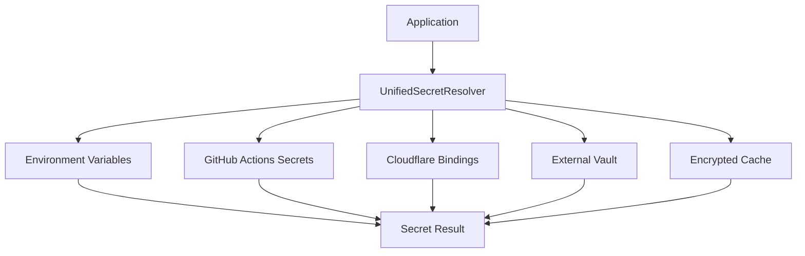
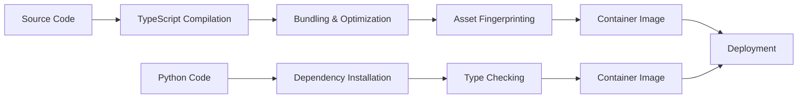

# Royal Equips Orchestrator - Phase 1 Architecture

Mobile-first, responsive architecture with modular design and comprehensive observability.

## Overview

The Royal Equips Orchestrator Phase 1 foundation implements:

- **Mobile-First UI**: Responsive design from 320px to ultra-wide displays
- **Modular Architecture**: Lazy-loaded modules with placeholder system
- **Observability**: Structured logging, performance tracking, and health monitoring
- **Security**: RBAC system with role hierarchy and permissions
- **Secret Management**: Multi-layer secret resolution with encryption

## Architecture Principles

### 1. Mobile-First Design

- **Baseline**: 320px viewport (iPhone SE)
- **Progressive Enhancement**: Features and layout adapt to larger screens
- **Touch-First**: Optimized for touch interactions with keyboard support
- **Performance Budget**: LCP < 2.5s, TTI < 3.5s, CLS < 0.05

### 2. Component Hierarchy

```
┌─ AppShell (Mobile Layout Container)
├─── TopNav (Collapsible Navigation)
├─── ModuleScroller (Horizontal Module Navigation)
├─── StatusStrip (Connection/Health Indicators)  
├─── ContentViewport (Module Content Area)
│    ├─── ModulePlaceholder (Coming Soon States)
│    ├─── ErrorBoundary (Error Fallbacks)
│    └─── Suspense (Loading States)
└─── ToastContainer (Notifications)
```

### 3. Module System

Each module follows a consistent structure:

```
/modules/{module-name}/
├─ index.tsx          # Module entry point + lazy loading
├─ components/        # Module-specific components  
├─ hooks/            # Module-specific React hooks
├─ services/         # API calls and business logic
├─ types/            # TypeScript interfaces
└─ tests/            # Module tests
```

## Directory Structure

```
apps/command-center-ui/
├─ src/
│  ├─ modules/
│  │  ├─ _shared/           # Shared components & utilities
│  │  │  ├─ components/     # ModuleScroller, ModulePlaceholder
│  │  │  ├─ hooks/          # useAuth, usePerformance
│  │  │  ├─ providers/      # Context providers
│  │  │  └─ layout/         # Layout components
│  │  ├─ command/           # Landing page & capability matrix
│  │  ├─ dashboard/         # KPI panels & live metrics
│  │  ├─ shopify/           # Store sync & status
│  │  ├─ products/          # Product management
│  │  ├─ analytics/         # Charts & reporting (lazy)
│  │  ├─ agents/            # Agent monitoring
│  │  ├─ settings/          # Configuration & secrets
│  │  └─ ...               # Additional modules
│  ├─ styles/
│  │  ├─ tokens.css         # Design system tokens
│  │  └─ globals.css        # Global styles
│  └─ ...

core/                       # Shared business logic
├─ secrets/                 # Multi-layer secret resolution
├─ security/                # RBAC & authentication
├─ logging/                 # Structured JSON logging
├─ metrics/                 # Performance tracking
└─ errors/                  # Error handling utilities

tests/
├─ unit/                   # Unit tests
├─ integration/            # Integration tests
└─ python/                 # Python-specific tests
```

## Design System

### Tokens Structure

The design system uses CSS custom properties for consistency:

```css
:root {
  /* Colors - Neon Dark Theme */
  --color-bg: #020409;
  --color-surface: #0e1824;
  --color-accent-cyan: #05f4ff;
  --color-text-primary: #d6ecff;
  
  /* Typography - Fluid Scale */
  --font-size-base: clamp(1rem, 0.95rem + 0.25vw, 1.1rem);
  --font-size-xl: clamp(1.25rem, 1.15rem + 0.5vw, 1.5rem);
  
  /* Spacing - Consistent Scale */
  --space-4: 1rem;
  --space-6: 1.5rem;
  
  /* Layout - Responsive Constraints */
  --nav-height: clamp(56px, 5vw, 64px);
}
```

### Responsive Breakpoints

- **Mobile**: 320px - 639px (Primary focus)
- **Tablet**: 640px - 1023px  
- **Desktop**: 1024px - 1279px
- **Large**: 1280px+

## Component Specifications

### ModuleScroller

**Purpose**: Horizontal navigation between modules with touch/keyboard support

**Features**:
- Scroll-snap for smooth navigation
- Keyboard navigation (Tab, Arrow keys, Home/End)
- ARIA role="tablist" for accessibility
- Status indicators (active, coming-soon, disabled)
- Auto-scroll active item to center

**Implementation**:
```tsx
<ModuleScroller
  modules={moduleDefinitions}
  activeId={currentModule}
  onNavigate={(path, moduleId) => navigate(path)}
  ariaLabel="Primary Modules"
/>
```

### ModulePlaceholder

**Purpose**: Consistent "coming soon" states with skeleton loading

**Features**:
- Configurable status badges (coming-soon, in-development, maintenance)
- Feature lists and estimated completion dates
- Animated skeleton grids
- Multiple sizes (sm, md, lg)

**Implementation**:
```tsx
<ModulePlaceholder
  title="Analytics"
  description="Advanced reporting and insights"
  status="in-development"
  estimatedCompletion="Q2 2024"
  features={['Real-time dashboards', 'Custom reports', 'Anomaly detection']}
/>
```

## RBAC Integration

### Role Hierarchy

```
ROOT (4)      # Full system access
├─ ADMIN (3)  # System configuration, user management  
├─ OPERATOR (2) # Execute operations, manage workflows
├─ ANALYST (1)  # Analyze data, create reports
└─ VIEWER (0)   # Read-only access
```

### UI Integration

```tsx
import { useRoleCheck } from '../core/security/rbac';

function AdminPanel() {
  const auth = useRoleCheck(user.role);
  
  if (!auth.canAdmin()) {
    return <ForbiddenMessage requiredRole="ADMIN" />;
  }
  
  return <AdminInterface />;
}

// Component-level guards
<RoleGuard required="OPERATOR" userRole={user.role}>
  <DangerousButton />
</RoleGuard>
```

### API Protection

```typescript
import { createAuthGuard } from '../core/security/rbac';

// Express/Fastify middleware
app.get('/api/admin/users', 
  createAuthGuard({ required: 'ADMIN', auditAction: 'users:list' }),
  getUsersHandler
);
```

## Observability Architecture

### Structured Logging

All components use consistent JSON logging:

```typescript
import { logger } from '../core/logging/logger';

logger.info('module_load', {
  module: 'analytics',
  load_time_ms: 150,
  user_id: user.id
});

// Request-scoped logging
const requestLogger = createRequestLogger(requestId, userId);
requestLogger.warn('validation_failed', { field: 'email', reason: 'invalid_format' });
```

### Performance Tracking

```typescript
import { mark, measure, time } from '../core/metrics/perf';

// Manual marks
mark('component_render_start');
// ... component rendering
measure('component_render', 'component_render_start');

// Function timing
const result = await time('api_call', () => fetchUserData(), { endpoint: '/users' });

// Decorator support
@timed('database_query')
async function queryUsers() { /* ... */ }
```

### Health Endpoints

**TypeScript (Fastify)**:
- `GET /health` - Basic liveness check
- `GET /healthz` - Kubernetes liveness probe  
- `GET /readyz` - Comprehensive readiness check
- `GET /metrics` - Performance and cache metrics

**Python (FastAPI)**:
```python
from core.health_service import create_health_app

app = create_health_app()
# Automatic health endpoints available
```

## Security Architecture

### Secret Management



### Request Security

1. **Authentication**: JWT/session validation
2. **Authorization**: RBAC role checking
3. **Audit Logging**: All privileged actions logged
4. **Rate Limiting**: Per-user request limits
5. **CSP Headers**: Content Security Policy enforcement

## Performance Optimizations

### Code Splitting

```typescript
// Route-level splitting
const AnalyticsModule = lazy(() => import('./modules/analytics'));
const ProductsModule = lazy(() => import('./modules/products'));

// Component-level splitting for heavy features
const ChartComponent = lazy(() => import('./components/HeavyChart'));
```

### Caching Strategy

1. **Static Assets**: Long-term caching with fingerprinting
2. **API Responses**: React Query with stale-while-revalidate
3. **Secrets**: Encrypted in-memory cache with TTL
4. **Component State**: Zustand for global state management

### Loading States

```tsx
<Suspense fallback={<ModulePlaceholder title="Loading..." size="sm" />}>
  <LazyModule />
</Suspense>
```

## Testing Strategy

### Unit Tests

- **Secret Resolution**: All provider combinations and error scenarios
- **RBAC**: Role checking and authorization edge cases  
- **Components**: Interaction and accessibility testing
- **Performance**: Timing and metrics collection

### Integration Tests

- **End-to-End Flows**: Complete user journeys
- **API Contracts**: Health endpoints and error responses
- **Cross-Browser**: Mobile viewport testing

### Coverage Targets

- **Core Logic**: >90% line coverage
- **UI Components**: >80% line coverage
- **API Endpoints**: 100% path coverage

## Deployment Architecture

### Build Process



### Environment Configuration

```bash
# Development
NODE_ENV=development
LOG_LEVEL=debug
SECRET_ENCRYPTION_KEY=dev-key-change-in-production

# Production  
NODE_ENV=production
LOG_LEVEL=info
SECRET_ENCRYPTION_KEY=<32-byte-secure-key>
HEALTH_CHECK_INTERVAL=30000
```

## Monitoring & Alerting

### Key Metrics

- **Frontend**: Core Web Vitals, JavaScript errors, page load times
- **Backend**: Response times, error rates, secret resolution latency
- **System**: Memory usage, CPU utilization, cache hit ratios

### Alert Conditions

- Error rate > 5% for 5 minutes
- P95 response time > 5 seconds
- Secret resolution failures > 10% 
- Memory usage > 80%

## Migration Path

### Phase 1 → Phase 2

1. **Add Real Data Sources**: Connect to actual APIs and databases
2. **Implement Analytics**: Replace placeholders with real charting
3. **Add Agent Management**: Full CRUD for autonomous agents
4. **Enhanced Security**: OAuth integration and session management

### Backward Compatibility

- Design system tokens remain stable
- Core API contracts maintained
- Module registration system supports extensions
- Database schema evolution through migrations

## Troubleshooting

### Common Issues

**Module Loading Errors**
```
ChunkLoadError: Loading chunk analytics failed
```
- Check network connectivity
- Verify CDN/asset availability
- Clear browser cache

**Permission Denied**
```json
{"error": "Forbidden", "required_role": "ADMIN", "user_role": "VIEWER"}
```
- Verify user role assignment
- Check RBAC configuration
- Review audit logs for context

**Performance Issues**  
- Monitor Core Web Vitals in browser devtools
- Check bundle size with webpack-bundle-analyzer
- Review performance marks in Network tab

### Debug Tools

- React DevTools for component inspection
- Redux DevTools for state management
- Browser Performance tab for timing analysis
- Network tab for API monitoring

## Future Considerations

### Scalability

- **Horizontal Scaling**: Load balancer + multiple instances
- **Database Sharding**: User-based partitioning
- **CDN Integration**: Global asset distribution
- **Caching Layers**: Redis for distributed caching

### Performance

- **Service Workers**: Offline functionality and caching
- **WebAssembly**: CPU-intensive computations
- **Web Workers**: Background processing
- **Streaming**: Server-side rendering with streaming

### Security

- **Zero-Trust Architecture**: Verify every request
- **Secrets Rotation**: Automated key rotation
- **Audit Compliance**: SOC2/ISO27001 requirements
- **Threat Detection**: Behavioral analysis

This architecture provides a solid foundation for Phase 1 while maintaining flexibility for future enhancements and scale.